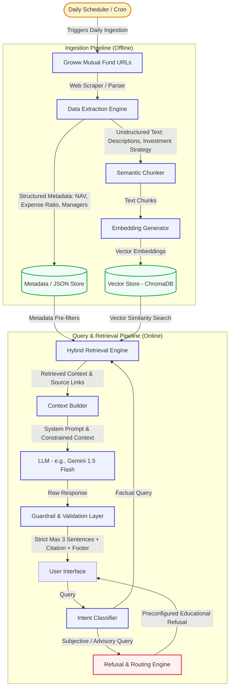

# Architecture Design: Mutual Fund FAQ Assistant

This document outlines the detailed system architecture for the **Mutual Fund FAQ Assistant**. It details a lightweight, compliant, and robust **Retrieval-Augmented Generation (RAG)** pipeline designed to provide facts-only answers with strict citations while rejecting advisory queries.

---

## System Architecture Overview

The system consists of two primary pipelines:
1. **Offline Ingestion Pipeline**: Scrapes Groww mutual fund URLs, processes the raw content, extracts structured key-value attributes and unstructured descriptions, embeds the data, and stores it in a local database.
2. **Online Query & Retrieval Pipeline**: Classifies user queries, retrieves factual context using a hybrid search strategy, structures the context, and instructs the Large Language Model (LLM) to generate a highly constrained, cited, facts-only response.

### High-Level Architecture Diagram



---

## Core Components

### 1. Data Ingestion & Extraction Layer
To guarantee factual accuracy, the system uses a hybrid scraping mechanism. Mutual fund pages are highly structured, meaning standard semantic chunking could lose critical data like the exact expense ratio or exit load.

- **Scheduler Job**: A daily cron job triggers the ingestion pipeline to ensure all fund data (NAV, expense ratios) remains current and compliant with daily market fluctuations.
- **Web Scraper**: Built using `BeautifulSoup` or `Playwright` to extract HTML content from the 5 configured Groww URLs.
- **Dual-Representation Ingestion**:
  - **Structured Key-Value Store**: Extracts exact quantitative metrics (NAV, Expense Ratio, Exit Load, Minimum SIP, Riskometer, Benchmark, and Fund Managers) and stores them as structured JSON.
  - **Unstructured Chunks**: Extracts textual details (fund strategy, manager backgrounds/experience, etc.) and segments them into semantic chunks with a 500-character size and 100-character overlap.

### 2. Retrieval & Hybrid Search Layer
Standard vector similarity searches can suffer from "cross-talk" (e.g., retrieving SBI Fund details when asking about HDFC). To prevent this:

- **Metadata Pre-Filtering**: The retrieval engine uses **Deterministic Extraction** to identify which scheme the user is querying. If a specific scheme is mentioned (e.g., "HDFC Defence Fund"), the search query in ChromaDB is pre-filtered by `metadata.scheme_name`.
- **Hybrid Retrieval**: Merges Vector Search (for semantic query mapping) and Exact Keyword Matching (for specific parameters like "exit load" or "expense ratio") to guarantee the correct numbers are retrieved.

### 3. Intent Classification & Refusal Router
Compliance is a non-negotiable success criterion. The bot must not provide investment opinions.

* **Intent Classifier**: A lightweight classification module (rules-based keyword mapping combined with prompt classification) that parses the query:
  * **Factual Query** (Allowed): *"Who manages HDFC Small Cap?", "What is the exit load of HDFC Large Cap?"* $\rightarrow$ routed to retrieval.
  * **Advisory/Subjective Query** (Refused): *"Is HDFC Defence Fund good to buy?", "SBI vs HDFC, which is better?"* $\rightarrow$ routed to the Refusal Engine.
* **Refusal Engine**: Automatically overrides LLM generation when an advisory query is detected, returning a polite refusal:
  > *"I am a facts-only assistant and do not provide investment advice or comparisons. For educational guidelines, please visit [SEBI Investor Education](https://investor.sebi.gov.in) or [AMFI India](https://www.amfiindia.com)."*

### 4. Generation & Compliant Guardrails
Once valid context is retrieved, it is sent to the LLM (e.g., `gemini-1.5-flash` or `gpt-4o-mini`).

* **System Prompt Design**:
  * Instructs the LLM to strictly rely *only* on the provided context. If the information is not in the context, it must state that it doesn't know.
  * Forbids comparisons, returns projections, or buy/sell recommendations.
  * Enforces the output structure.
* **Validation Layer**: A programmatic wrapper that checks the generated response before showing it to the user:
  1. **Length Check**: Validates that the response contains at most 3 sentences.
  2. **Citation Check**: Verifies that exactly one source link from the original Groww URLs is appended.
  3. **Footer Check**: Inserts the footer: `Last updated from sources: <current_date>`.

---

## Data Schema (Vector Store Metadata)

To enable precise filtering, the ChromaDB documents will store the following metadata payload:

```json
{
  "scheme_name": "HDFC Mid-Cap Opportunities Fund",
  "url": "https://groww.in/mutual-funds/hdfc-mid-cap-fund-direct-growth",
  "category": "Equity - Mid Cap",
  "metrics": {
    "expense_ratio": "0.91%",
    "exit_load": "1% for redemption within 1 year",
    "min_sip": "₹100",
    "riskometer": "Very High",
    "benchmark": "NIFTY Midcap 150 TRI"
  },
  "fund_managers": [
    {
      "name": "Chirag Setalvad",
      "tenure": "11 years",
      "experience": "Over 20 years in equity research and fund management"
    }
  ],
  "last_updated": "2026-06-02"
}
```

---

## Interface (UI) Design

A clean, premium, and minimal chat interface will be provided (implemented using Streamlit or a React single-page app):

* **Sticky Disclaimer Banner**: Located at the top of the interface:
  > ⚠️ **Facts-only Assistant**: I only answer objective, factual queries. I do **not** provide investment advice or fund recommendations.
* **Quick-Start Example Buttons**: 3 predefined questions to demonstrate capabilities:
  * *"What is the expense ratio and benchmark of HDFC Defence Fund?"*
  * *"Who manages the HDFC Small Cap Fund and what is their tenure?"*
  * *"What are the exit load details of HDFC Top 100 Fund?"*
* **Response Formatting**: Clean, legible bubbles where citations are rendered as hyperlinked badges rather than messy inline text.

---

## Technical Stack Recommendation

| Component | Technology Option | Rationale |
| :--- | :--- | :--- |
| **Backend & Pipeline** | Python (FastAPI / LangChain) | Excellent RAG ecosystem, lightweight, and fast execution. |
| **Scraper** | BeautifulSoup / Playwright | BeautifulSoup for speed; Playwright if Groww's React hydration requires dynamic rendering. |
| **Vector Database** | ChromaDB (Local) | Serverless, stores metadata along with vector chunks, extremely fast setup. |
| **LLM Model** | Google Gemini 1.5 Flash | High speed, cost-effective, extremely capable at strict instructions and structured json processing. |
| **Frontend UI** | Streamlit | Rapid development, natively supports markdown, clean design, and immediate deployment. |
