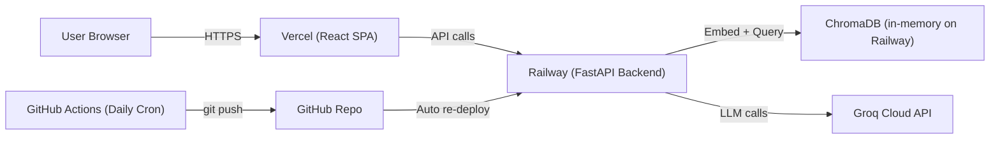
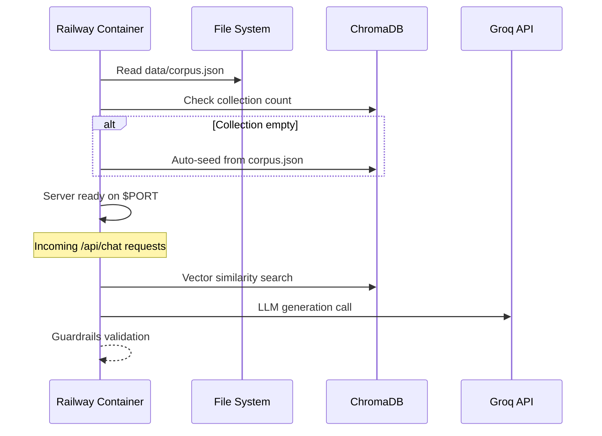
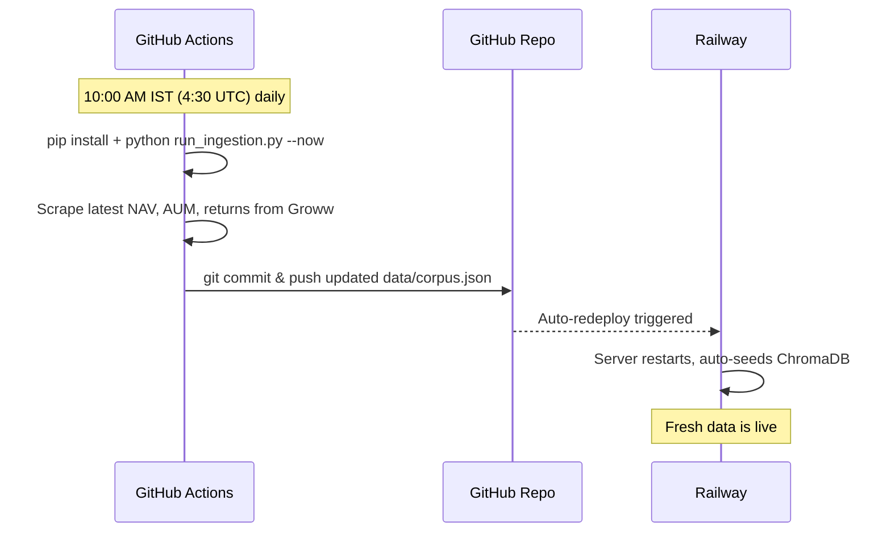

# Deployment Plan: Mutual Fund RAG Chatbot

> **Backend** → Railway (Python FastAPI)
> **Frontend** → Vercel (React + Vite SPA)

---

## Architecture Overview



| Layer | Technology | Host | URL Pattern |
|-------|-----------|------|-------------|
| Frontend | React 19 + Vite 8 | Vercel | `https://<project>.vercel.app` |
| Backend API | FastAPI + Uvicorn | Railway | `https://<service>.up.railway.app` |
| Vector DB | ChromaDB (ephemeral) | Railway (same container) | Internal to backend |
| LLM | Groq (llama-3.3-70b) | Groq Cloud | External API |
| Scheduler | GitHub Actions cron | GitHub | Commits updated `data/corpus.json` |

---

## Part 1: Backend Deployment on Railway

### 1.1 Prerequisites

- A [Railway](https://railway.app) account (free hobby tier is sufficient to start).
- The GitHub repository `ghratika/Mutual-Fund-Chatbot` linked to Railway.
- Your `GROQ_API_KEY` value ready to paste as an environment variable.

### 1.2 Files to Create Before Deploying

#### [NEW] `Procfile` (project root)

Railway uses a `Procfile` to know how to start the application.

```
web: uvicorn server:app --host 0.0.0.0 --port $PORT
```

> [!IMPORTANT]
> Railway injects the `$PORT` environment variable at runtime. You **must** bind to `0.0.0.0` (not `127.0.0.1`) and use `$PORT` for Railway to detect a healthy service.

#### [NEW] `runtime.txt` (project root)

Pins the Python version on Railway.

```
python-3.10.14
```

#### [EXISTING] `requirements.txt`

Already created. Railway will auto-detect this file and run `pip install -r requirements.txt` during build.

### 1.3 Railway Setup Steps

| Step | Action |
|------|--------|
| **1** | Log in to [railway.app](https://railway.app) and click **"New Project"** → **"Deploy from GitHub Repo"**. |
| **2** | Select the repository `ghratika/Mutual-Fund-Chatbot`. |
| **3** | Railway will auto-detect `requirements.txt` and `Procfile`. No custom build command is needed. |
| **4** | Go to the **Variables** tab and add: |

**Environment Variables to set on Railway:**

| Variable | Value | Notes |
|----------|-------|-------|
| `GROQ_API_KEY` | `gsk_...your key...` | Required for LLM generation |
| `PORT` | *(auto-injected by Railway)* | Do not set manually |

| Step | Action |
|------|--------|
| **5** | Click **"Deploy"**. Railway will build the container and start the server. |
| **6** | Once deployed, go to **Settings → Networking → Generate Domain** to get a public URL like `https://mutual-fund-chatbot-production.up.railway.app`. |
| **7** | Test the health of the API by visiting `https://<your-railway-url>/api/funds` in a browser. It should return a JSON array of 5 funds. |

> [!NOTE]
> On the first cold start, the backend will auto-seed the ChromaDB vector store from `data/corpus.json` (this takes ~30–60 seconds as it downloads the BGE embedding model). Subsequent requests will be fast.

### 1.4 How the Backend Works on Railway



> [!WARNING]
> Railway's free hobby tier containers are **ephemeral** — the ChromaDB database stored in `db/` will be rebuilt on every redeploy. This is acceptable because auto-seeding from `data/corpus.json` handles this automatically. For production, consider attaching a Railway **Volume** to persist the `db/` directory across deploys.

---

## Part 2: Frontend Deployment on Vercel

### 2.1 Prerequisites

- A [Vercel](https://vercel.com) account (free hobby tier works).
- The same GitHub repository `ghratika/Mutual-Fund-Chatbot` connected.

### 2.2 Code Change Required: Environment-Aware API URL

The frontend currently hardcodes the API base URL to `http://localhost:8000`. This must be changed to read from an environment variable at build time.

#### [MODIFY] `frontend/src/App.jsx`

Change line 13 from:

```diff
- const API_BASE_URL = 'http://localhost:8000';
+ const API_BASE_URL = import.meta.env.VITE_API_BASE_URL || 'http://localhost:8000';
```

This allows:
- **Local development**: Falls back to `http://localhost:8000` when no env var is set.
- **Vercel production**: Reads the Railway backend URL from the build-time environment variable.

### 2.3 Vercel Setup Steps

| Step | Action |
|------|--------|
| **1** | Log in to [vercel.com](https://vercel.com) and click **"Add New Project"** → **"Import Git Repository"**. |
| **2** | Select the repository `ghratika/Mutual-Fund-Chatbot`. |
| **3** | Configure the build settings as follows: |

**Vercel Build Settings:**

| Setting | Value |
|---------|-------|
| **Framework Preset** | Vite |
| **Root Directory** | `frontend` |
| **Build Command** | `npm run build` |
| **Output Directory** | `dist` |
| **Install Command** | `npm install` |

> [!IMPORTANT]
> You **must** set the **Root Directory** to `frontend` because the React app lives in a subdirectory of the monorepo, not at the project root.

| Step | Action |
|------|--------|
| **4** | Go to **Settings → Environment Variables** and add: |

**Environment Variables to set on Vercel:**

| Variable | Value | Notes |
|----------|-------|-------|
| `VITE_API_BASE_URL` | `https://<your-railway-url>` | The Railway public URL from Part 1, Step 6. **No trailing slash.** |

| Step | Action |
|------|--------|
| **5** | Click **"Deploy"**. Vercel will build the Vite app and serve it on a `.vercel.app` domain. |
| **6** | Visit `https://<your-project>.vercel.app` to confirm the UI loads. |

### 2.4 CORS Configuration

The FastAPI backend now reads the allowed origin from a **Railway environment variable** `CORS_ORIGINS`. Set it after you have your Vercel URL:

**Railway Variable to add (after Vercel is deployed):**

| Variable | Value | Notes |
|----------|-------|-------|
| `CORS_ORIGINS` | `https://<your-project>.vercel.app` | Comma-separated if multiple domains |

If `CORS_ORIGINS` is not set, the server defaults to `"*"` (open) — safe for testing, but lock it down in production.

### 2.5 SPA Routing (`vercel.json`)

A `frontend/vercel.json` has been created that rewrites all non-API routes to `index.html`, so direct URL access works correctly on Vercel:

```json
{
  "rewrites": [
    { "source": "/((?!api/).*)", "destination": "/index.html" }
  ]
}
```

---

## Part 3: Daily Ingestion via GitHub Actions

The daily ingestion pipeline is already configured in `.github/workflows/daily-ingestion.yml`.

### How the Data Pipeline Flows



### GitHub Secret Required

Go to **GitHub → Repository → Settings → Secrets and variables → Actions** and add:

| Secret Name | Value |
|-------------|-------|
| `GROQ_API_KEY` | Your Groq API key (same one used on Railway) |

> [!NOTE]
> The `GROQ_API_KEY` secret in GitHub Actions is only needed if the ingestion script requires LLM calls. Currently `run_ingestion.py --now` only scrapes and updates the database, so it is optional. But setting it ensures future-proofing.

---

## Part 4: Complete Deployment Checklist

### Files to Create/Modify Before Deploying

| Action | File | Description |
|--------|------|-------------|
| ✅ **Done** | `Procfile` | Railway start command |
| ✅ **Done** | `runtime.txt` | Python version pin (`python-3.10.14`) |
| ✅ **Done** | `railway.json` | Healthcheck path `/health`, 120s timeout, restart policy |
| ✅ **Done** | `frontend/vercel.json` | SPA rewrite rules for React client-side routing |
| ✅ **Done** | `frontend/src/App.jsx` (line 13) | Uses `import.meta.env.VITE_API_BASE_URL` |
| ✅ **Done** | `requirements.txt` | Added `uvicorn[standard]` + `python-dotenv` |
| ✅ **Done** | `server.py` | Lifespan init, `/health` endpoint, `CORS_ORIGINS` env var |
| *(Already exists)* | `.github/workflows/daily-ingestion.yml` | Cron scheduler |

### Step-by-Step Deploy Order

```
1. Create Procfile and runtime.txt
2. Modify frontend/src/App.jsx (API_BASE_URL)
3. Commit & push all changes to GitHub
4. Deploy Backend on Railway
   → Set GROQ_API_KEY env var
   → Generate public domain
   → Test /api/funds endpoint
5. Deploy Frontend on Vercel
   → Set Root Directory = frontend
   → Set VITE_API_BASE_URL = Railway URL
   → Deploy and verify UI
6. Set GROQ_API_KEY in GitHub Actions Secrets
7. End-to-end test: send a chat message from Vercel UI
```

### Verification Tests

| Test | Expected Result |
|------|----------------|
| `GET https://<railway>/api/funds` | JSON array of 5 fund objects |
| `POST https://<railway>/api/chat` with `{"message": "hi"}` | Welcome message with 5 fund names |
| Visit `https://<vercel>.vercel.app` | Chat UI loads with disclaimer banner |
| Send "What is the NAV of HDFC Small Cap Fund?" from UI | Factual response with citation link |
| Trigger GitHub Actions workflow manually | `data/corpus.json` updated and committed |

---

## Cost Estimate

| Service | Tier | Monthly Cost |
|---------|------|-------------|
| Railway | Hobby (Trial $5 credit) | ~$0–5/month |
| Vercel | Hobby | Free |
| Groq API | Free tier | Free (rate-limited) |
| GitHub Actions | Free tier (2000 min/month) | Free |

> [!TIP]
> The entire stack can run for **free** within the hobby/trial tiers of all four services. Railway's $5 trial credit is enough for several months of light usage since the server only consumes resources when handling requests.
